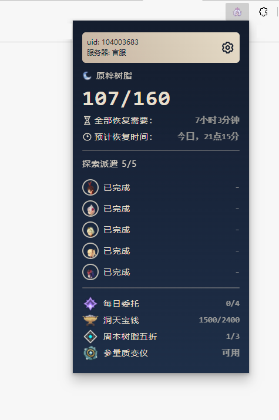

<p align='center'>
</p>

# 派蒙 Paimon


[](https://addons.mozilla.org/zh-CN/firefox/addon/%E6%B4%BE%E8%92%99-paimon/)
[](https://chrome.google.com/webstore/detail/%E6%B4%BE%E8%92%99-paimon/ecafadojbjpamdlbhdgmfhihdojeekdd)
[](https://microsoftedge.microsoft.com/addons/detail/%E6%B4%BE%E8%92%99-paimon/amlfaonbmcninlpijbjkblmfgcanjdih)

> 在浏览器中查看原神账号情况(目前仅支持官服、B服)
> Check your Genshin Impact account status in your browser. (China Server Support Only)

[Firefox Addons 链接](https://addons.mozilla.org/zh-CN/firefox/addon/%E6%B4%BE%E8%92%99-paimon/)

[Chrome Webstore 链接](https://chrome.google.com/webstore/detail/%E6%B4%BE%E8%92%99-paimon/ecafadojbjpamdlbhdgmfhihdojeekdd)

[Edge Webstore 链接](https://microsoftedge.microsoft.com/addons/detail/amlfaonbmcninlpijbjkblmfgcanjdih)

## 开发 Development

```
pnpm dev
```

## 调试 Debug

### firefox:

```
pnpm start:firefox
```

### chromium:

```
pnpm start:chromium
```

## 构建 Build

```
pnpm build
```

## 使用截图 Screenshot



## 相关 Related
- UI 参考: [spencerwooo/PaimonMenuBar](https://github.com/spencerwooo/PaimonMenuBar)
- [[心得交流] [工具分享] 在浏览器里直接查看自己树脂情况的小工具](https://bbs.nga.cn/read.php?tid=31590015)

## 协议 License


