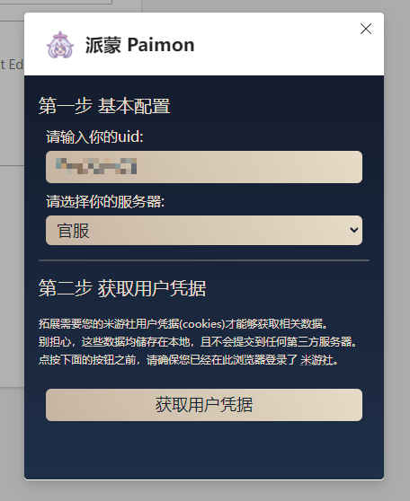

<p align='center'>
</p>

# 派蒙 Paimon

> 在浏览器中查看原神账号情况(目前仅支持官服、B服)
> Check your Genshin Impact account status in your browser. (China Server Support Only)

Developing...

### 开发

chrome/edge:

```
pnpm dev
```

firefox:

```
pnpm start:firefox
```

### 构建

```
pnpm build
```

### 截图


